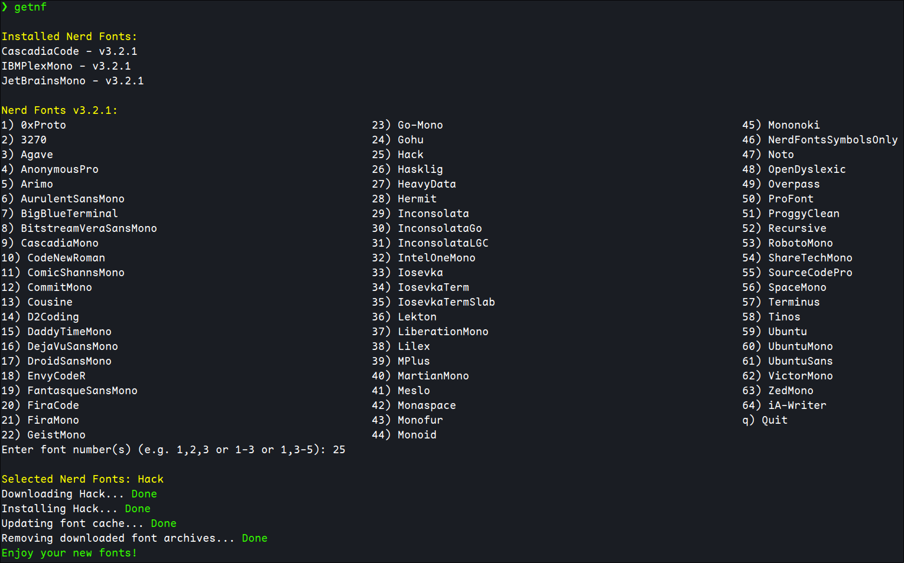

# `getnf` - Get Nerd Fonts

[](https://github.com/getnf/getnf/releases/latest)
[](https://github.com/getnf/getnf/pulse)
[](https://github.com/getnf/getnf/issues)
[](https://github.com/getnf/getnf/blob/master/LICENSE)
[](https://github.com/getnf/getnf/stargazers)

Easily install [Nerd Fonts](https://www.nerdfonts.com/) from the terminal.



## Supported Platforms

`getnf` is supported on macOS and Linux.

## Requirements

- curl
- fzf _(optional)_

## Install

Make sure that `~/.local/bin` is in your PATH.

Install the latest version with:

```sh
curl -fsSL https://raw.githubusercontent.com/getnf/getnf/main/install.sh | bash
```

To pass options to the installer, use:

```sh
curl -fsSL https://raw.githubusercontent.com/getnf/getnf/main/install.sh | bash -s -- <options>
```

Installer options:

- `--tag=<tag>`: Install a specific [release](https://github.com/getnf/getnf/releases), e.g. `--tag=v0.3.0`
- `--silent`, `-s`: Suppress installation output

Examples:

```sh
curl -fsSL https://raw.githubusercontent.com/getnf/getnf/main/install.sh | bash -s -- --tag=v0.3.0
curl -fsSL https://raw.githubusercontent.com/getnf/getnf/main/install.sh | bash -s -- --silent
curl -fsSL https://raw.githubusercontent.com/getnf/getnf/main/install.sh | bash -s -- --tag=v0.3.0 --silent
```

## Other Installation Methods

You can also install `getnf` using the following tools or download a package
or tarball from the [latest release](https://github.com/getnf/getnf/releases/latest).

| Source                                                            | How to install                        | Notes                  |
| ----------------------------------------------------------------- | ------------------------------------- | ---------------------- |
| AUR ([stable](https://aur.archlinux.org/packages/getnf))          | `paru -S getnf`                       | Stable release         |
| AUR ([development](https://aur.archlinux.org/packages/getnf-git)) | `paru -S getnf-git`                   | Development version    |
| [Homebrew](https://github.com/getnf/homebrew-getnf)               | `brew install getnf/getnf/getnf`      | macOS / Homebrew users |
| [mise](https://mise.jdx.dev/)                                     | `mise use -g github:getnf/getnf`      | macOS / Linux          |
| [deb-get](https://github.com/wimpysworld/deb-get)                 | `deb-get install getnf`               | Debian / Ubuntu        |
| [Release assets](https://github.com/getnf/getnf/releases/latest)  | Download `.deb`, `.rpm`, or `.tar.gz` | Manual installation    |

## Usage

Run `getnf` to show the font menu.

There are several flags available:

| Flag                                             | Description                                                                |
| ------------------------------------------------ | -------------------------------------------------------------------------- |
| `-h`                                             | Show the help message                                                      |
| `-k`                                             | Keep the downloaded font archives                                          |
| `-a`                                             | Include installed Nerd Fonts in the menu                                   |
| `-g`                                             | Install/Uninstall/List/Update Nerd Fonts for all users                     |
| `-l`                                             | List installed Nerd Fonts                                                  |
| `-L`                                             | List all available Nerd Fonts                                              |
| `-f`                                             | Select and install Nerd Fonts using [fzf](https://github.com/junegunn/fzf) |
| `-i <font>`                                      | Directly install a specified Nerd Font                                     |
| `-i <name1>,<name2>`,<br> `-i "<name1> <name2>"` | Directly install multiple Nerd Fonts                                       |
| `-u <font>`                                      | Uninstall a specified Nerd Font                                            |
| `-u <name1>,<name2>`,<br> `-u "<name1> <name2>"` | Uninstall multiple Nerd Fonts                                              |
| `-U`                                             | Update all installed Nerd Fonts                                            |
| `-V`                                             | Print the current version of `getnf`                                       |

You can get the exact names of the fonts to use with `-i` and `-u` from `getnf -L`.

Enjoy!

## Notes

In case you can't see newly installed fonts in your application, you may need to update the font cache with

```
fc-cache -f
```

## Uninstall

To remove `getnf` without deleting the installed fonts, run

```
rm -rf ~/.local/bin/getnf ~/.local/share/getnf
```

You can also remove the font archive directory from your Downloads folder with

```
rm -rf "$(command -v xdg-user-dir >/dev/null && xdg-user-dir DOWNLOAD || printf '%s\n' "$HOME/Downloads")/getnf"
```
